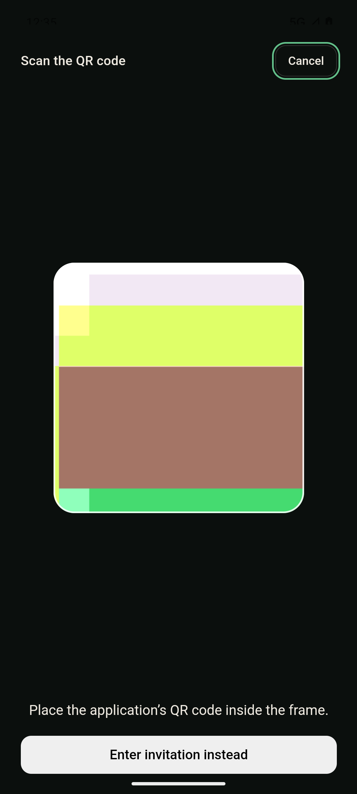

# Android pairing review and scanner verification

Verified on 2026-09-07 with an isolated Pixel 7 ARM64 emulator running Android API 36.

## Reproduction and fix

The original Android biometric plugin opens its own Activity. Opening the device-PIN prompt during `cbcl_v2_unlock_preview` made the WebView hidden. The UI cancelled the pairing and left the exact-request review inert. Window focus loss also incorrectly counted as application backgrounding in the native handler.

Android now uses the native application lifecycle for cancellation. The owned biometric Activity can hide the WebView without revoking pairing. A genuine application suspension still revokes native state and tells the UI to display an interruption result. Desktop visibility cancellation and page-unload cancellation remain covered by the browser regressions.

## Actual Android results

- A signed local invitation reached **Review the exact request** through real Tauri IPC, authenticated pairing, and Android-backed custody.
- Submitting the wallet passcode opened the actual Android device-PIN prompt. Completing that prompt reached **Review and link this device** with **Link enabled**.
- Pressing Home while the device-PIN prompt was pending cancelled pairing and displayed **Pairing interrupted**. Returning to the app allowed a fresh invitation to proceed successfully.
- The scanner displayed the emulator's live camera only inside the frame. The invitation form was hidden.
- **Enter invitation instead** restored and focused the invitation field. Android reported no active camera clients afterward.

The test stopped at the local identity review; it did not approve Link or claim end-to-end installation coverage.

The Android test APK was built from this PR's source and current-main dependency pins. Two networking files in a separate temporary build copy used the existing signed local fixture's ephemeral CA, a fixture-only relay address, and an ADB-forwarded HTTPS proxy. TLS names and certificate verification were retained. Those networking adaptations are not in this PR, and the test did not create a channel or invitation on the deployed chat service. The private CA, pairing invitation, passcodes, and test identity secrets are not included here.

## Automated checks

- `node --test tests/spec-007-wallet-pairing.mjs tests/spec-077-scan-pairing.mjs`: **35 passed**.
- `npm run screens`: **all screens rendered clean**, including accessibility, overflow, and missing-bridge checks.
- ARM64 Android debug APK built and installed successfully.
- `git diff --check`: clean.

New browser tests cover owned-Activity visibility changes, real native background notifications, interrupted unlock/page unload, camera form visibility, frame bounds, paste/cancel cleanup, and stale scan results.

[Machine-readable results and source hashes](results.json)

## Live scanner

The colored scene is the emulator camera feed, not a rendered placeholder.

